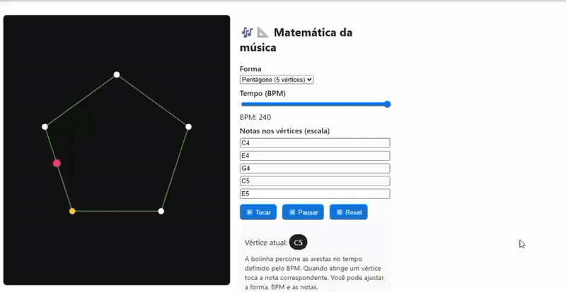

# 🎵 Music Canvas JS

Projeto interativo que utiliza **JavaScript + HTML5 Canvas** para criar visualizações dinâmicas baseadas em música 🎧✨

---

## 📚 Sobre o projeto

Este projeto permite usar gráficos e animações diretamente no navegador usando JavaScript.

A ideia é transformar som em elementos visuais, criando uma experiência mais interativa e visual.

---

## 🛠️ Tecnologias utilizadas

- HTML  
- CSS
- JavaScript  
- Canvas API  

---

## 🎯 Demonstração 

  

